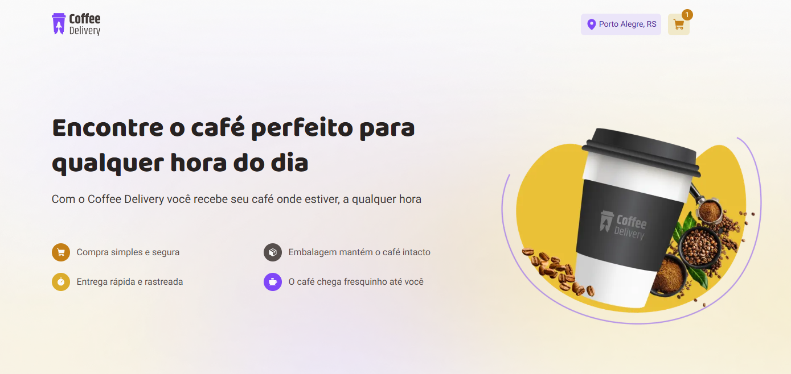
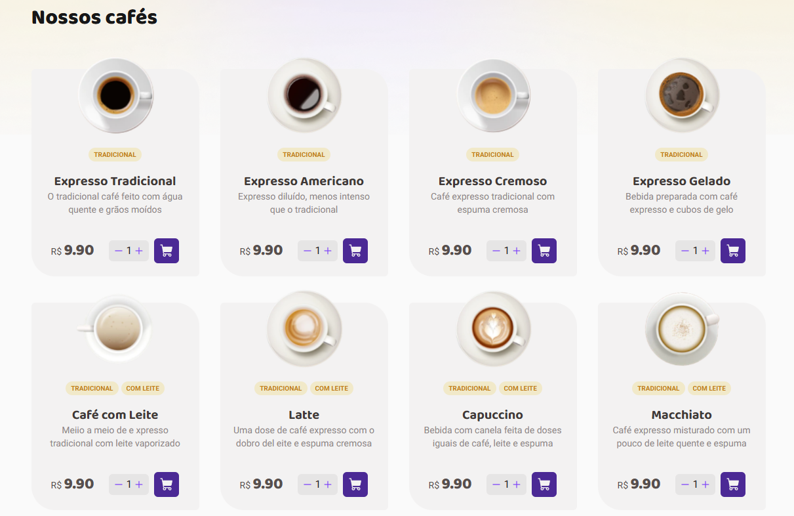

# ☕ Coffee Delivery

A modern and responsive coffee shop checkout app built with React, TypeScript, Tailwind CSS, and Next.js App Router. Browse and select your favorite coffee, fill out the address form, choose a payment method, and confirm your order — all with a smooth and intuitive interface.

## 🚀 Live Demo

Check out the live version: https://coffee-delivery-pi-ten.vercel.app/

## ✨ Features

✅ Browse available coffee types with quantity control

✅ Add and remove items from the cart

✅ Fill in a complete address form with validation

✅ Select payment method (credit, debit, cash)

✅ Order summary and confirmation page

✅ State management with React Context

✅ Form validation using Zod and React Hook Form

✅ LocalStorage for cart persistence

✅ Fully responsive layout with Tailwind CSS

## 📸 Screenshots

Example:

## 🛠️ Built With

- React
- Next.js (App Router)
- TypeScript
- Tailwind CSS
- React Hook Form
- Zod
- Phosphor Icons
- Radix-ui

## 📦 Getting Started

Follow the steps below to run the project locally:

1. Clone the repository
   `git clone https://github.com/Valdiberto/coffee-delivery.git`

2. Navigate into the project folder
   cd coffee-delivery

3. Install dependencies
   `npm install`

4. Start the development server
   `npm run dev`
   Open your browser and go to http://localhost:3000

## 🧪 Tests

This project does not currently include automated tests. Feel free to contribute with tests or improvements!

## 📁 Deployment

This project is ready for deployment with Vercel. Just connect your GitHub repo and deploy — no extra config needed.

## 📄 License

This project is licensed under the MIT License.

## 🙋 Author

Made with ❤️ by Valdiberto
